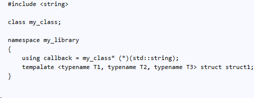

## C++ Code Generator Subsystem


This application is designed to automatically generate the content used in the header files:
- Inclusions (#include directives)
- Forward declaration types

This content is generated based on information received from the code generator program:
- List of available types from header files
- List of types for which inclusion is a priority
- Two lists of types to be generated
    -  For inclusions
    -  For forward declaration

The subsystem returns a string containing a ready block of inclusions and declarations.

### Examples

The arrangement of C++ types in header files is given:

- File ___\<string\>___ contains the definition of class ___std\::string___
- File ___"my_class.h"___ contains the definition of class ___my_class___
- File ___"my_library.h"___ contains definitions of type ___my_library\::callback___ - an alias to a pointer to a function which takes a single argument of type ___std\::string___ and returns a value of type ___my_class*___ and of template structure ___my_library\::struct1\<T1,T2,T3\>___


The generation subsystem receives information about available types:
```cs
Repository Repository = new Repository();
Repository.AvailableTypes["<string>"].Add(new Class("std::string"));
Repository.AvailableTypes["\"my_class.h\""].Add(new Class("my_class"));
Repository.AvailableTypes["\"my_library.h\""].Add(new Alias("my_library::callback", "my_class", "std::string"));
Repository.AvailableTypes["\"my_library.h\""].Add(new Struct("my_library::struct1<T1,T2,T3>"));
```
If you want to generate declarations for the alias ___my_library\::callback___ and the structure ___my_library\::struct1___, the  ___Сompiler___ class initialization looks like this:
```cs
Сompiler compiler = new Сompiler(Repository)
            {
                Declarations = { "my_library::struct1<T1,T2,T3>", "my_library::callback" }
            };
```

Including the ___\<string\>___ file containing the ___std::string___ class definition is defined by default because declarations for STL classes have portability issues.

After calling the:
```cs
Console.WriteLine(compiler.BuildOutput()); 
```
The result will be as follows:

